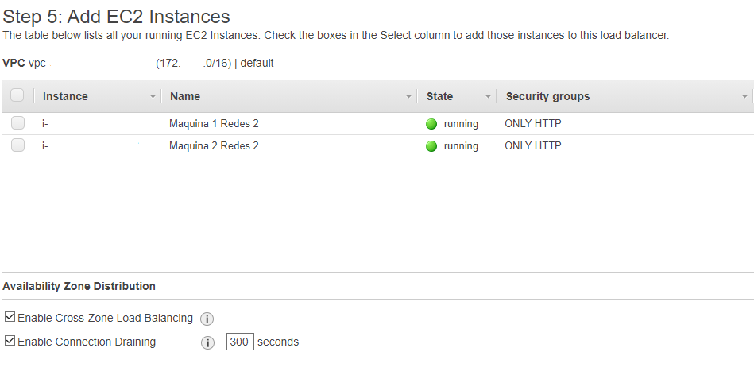

# REDES2_2S2020_Practica1_201504420

## Configuración de una EC2

### AMI elejida


### Tipo de instancia elejida


### Configuración de la instancia

Se dejo todo por defecto, y en la seccion avanzada, se escribio código de usuario, para poder levantar la página web.


**Código ingresado:**

```bash
#!/bin/bash
sudo apt-get update
sudo apt-get install apache2 -y
sudo apt-get update
curl -o- https://raw.githubusercontent.com/nvm-sh/nvm/v0.35.2/install.sh | bash
export NVM_DIR="$HOME/.nvm"
[ -s "$NVM_DIR/nvm.sh" ] && \. "$NVM_DIR/nvm.sh"
[ -s "$NVM_DIR/bash_completion" ] && \. "$NVM_DIR/bash_completion"
nvm install 14.15.0
curl -sS https://dl.yarnpkg.com/debian/pubkey.gpg | sudo apt-key add -
echo "deb https://dl.yarnpkg.com/debian/ stable main" | sudo tee /etc/apt/sources.list.d/yarn.list
sudo apt update
sudo apt install yarn -y
git clone https://github.com/NeftXx/REDES2_2S2020_Practica1_201504420.git redes2
cd redes2/web
yarn install
yarn run build
sudo mv build /var/www
cd /var/www
sudo rm -rf html
sudo mv build html
```

### Configuración del grupo de seguridad

Se creó un nuevo grupo, en el cual solo se permite el trafico por el puerto 80.


### Crear EC2

Luego de toda esta configuración, y esperar a que se termine de realizar el codigo escrito por el usuario. Se mostrará la siguiente página:


## Balanceador de carga

### Elección de tipo de balanceador

En esta sección, se elejió el balanceador de carga clásico.


### Configuración del balanceador

Habilitamos la configuración avanzada de VPC


En esta sección elegimos nuestras Subnets, en donde estan localizadas nuestras EC2.


Una vez elegida al menos 2 Subnets pasamos a la siguiente pantalla.


### Configuración del grupo de seguridad

Elegimos el mismo que usamos para las EC2.


### Configuración de la comprobación de estado


### Escoger EC2

Luego escogemos las EC2 que perteneceran al balanceador de carga.



Luego de crear el balanceador este nos dara un DNS, para poder visualizar nuestra página.

## Route53

### Zonas hospedadas

Para iniciar nos dirigimos a la sección de zonas hospedadas, y le damos al botón crear una zona alojada.


### Zona alojada

Para crear una zona alojada, primero debemos tener un dns para eso: en esta ocación se utilizo example.com. Luego de indicar el nombre de dominio, escogemos la opción de zona alojada pública.


Luego de crear la zona alojada, debemos dirigir nuestro tráfico a los servicios de aws, para esto debemos colocar los cuatro nombres de dominios que nos provee aws, en la configuración de nuestro proveedor dns.


### Registro

Ahora creamos un nuevo registro, de direccionamiento sencillo.


Luego definimos un registro simple


Con la siguiente configuración:


Luego de esto guardamos y podremos ya visualizar nuestra página a tráves de nuestro dominio, enlazado con nuestro balanceador de carga.
